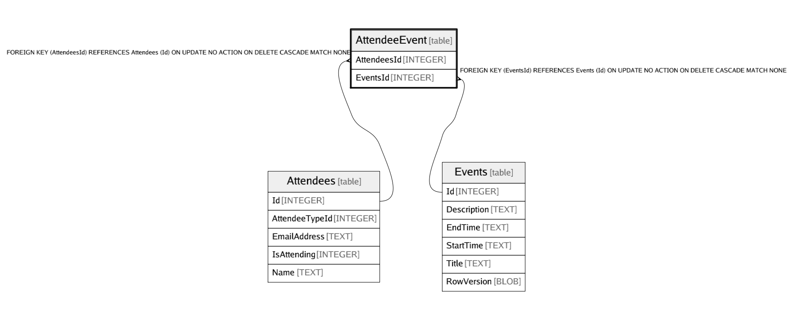

# AttendeeEvent

## Description

<details>
<summary><strong>Table Definition</strong></summary>

```sql
CREATE TABLE "AttendeeEvent" (
    "AttendeesId" INTEGER NOT NULL,
    "EventsId" INTEGER NOT NULL,
    CONSTRAINT "PK_AttendeeEvent" PRIMARY KEY ("AttendeesId", "EventsId"),
    CONSTRAINT "FK_AttendeeEvent_Attendees_AttendeesId" FOREIGN KEY ("AttendeesId") REFERENCES "Attendees" ("Id") ON DELETE CASCADE,
    CONSTRAINT "FK_AttendeeEvent_Events_EventsId" FOREIGN KEY ("EventsId") REFERENCES "Events" ("Id") ON DELETE CASCADE
)
```

</details>

## Columns

| Name | Type | Default | Nullable | Children | Parents | Comment |
| ---- | ---- | ------- | -------- | -------- | ------- | ------- |
| AttendeesId | INTEGER |  | false |  | [Attendees](Attendees.md) |  |
| EventsId | INTEGER |  | false |  | [Events](Events.md) |  |

## Constraints

| Name | Type | Definition |
| ---- | ---- | ---------- |
| AttendeesId | PRIMARY KEY | PRIMARY KEY (AttendeesId) |
| EventsId | PRIMARY KEY | PRIMARY KEY (EventsId) |
| - (Foreign key ID: 0) | FOREIGN KEY | FOREIGN KEY (EventsId) REFERENCES Events (Id) ON UPDATE NO ACTION ON DELETE CASCADE MATCH NONE |
| - (Foreign key ID: 1) | FOREIGN KEY | FOREIGN KEY (AttendeesId) REFERENCES Attendees (Id) ON UPDATE NO ACTION ON DELETE CASCADE MATCH NONE |
| sqlite_autoindex_AttendeeEvent_1 | PRIMARY KEY | PRIMARY KEY (AttendeesId, EventsId) |

## Indexes

| Name | Definition |
| ---- | ---------- |
| IX_AttendeeEvent_EventsId | CREATE INDEX "IX_AttendeeEvent_EventsId" ON "AttendeeEvent" ("EventsId") |
| sqlite_autoindex_AttendeeEvent_1 | PRIMARY KEY (AttendeesId, EventsId) |

## Relations



---

> Generated by [tbls](https://github.com/k1LoW/tbls)
