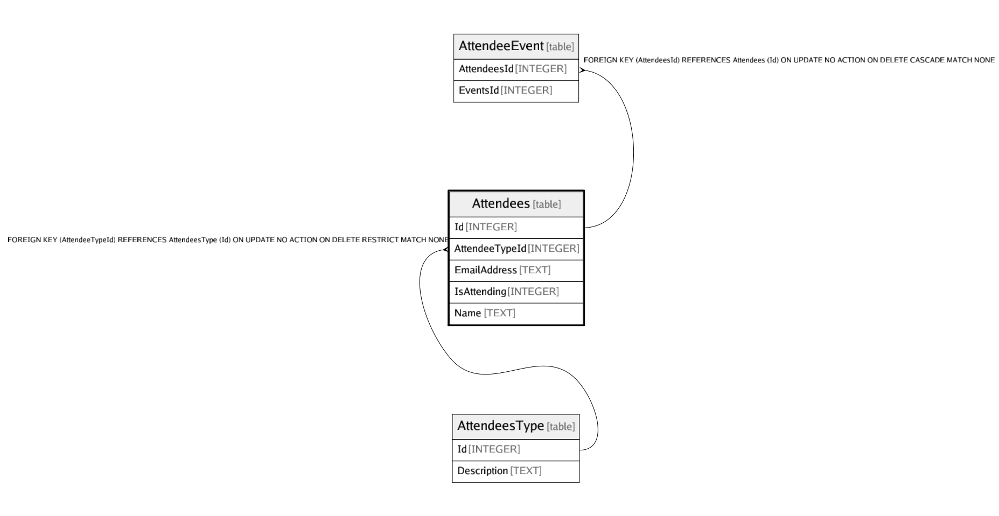

# Attendees

## Description

<details>
<summary><strong>Table Definition</strong></summary>

```sql
CREATE TABLE "Attendees" (
    "Id" INTEGER NOT NULL CONSTRAINT "PK_Attendees" PRIMARY KEY AUTOINCREMENT,
    "AttendeeTypeId" INTEGER NULL,
    "EmailAddress" TEXT NOT NULL,
    "IsAttending" INTEGER NOT NULL,
    "Name" TEXT NOT NULL,
    CONSTRAINT "FK_Attendees_AttendeesType_AttendeeTypeId" FOREIGN KEY ("AttendeeTypeId") REFERENCES "AttendeesType" ("Id") ON DELETE RESTRICT
)
```

</details>

## Columns

| Name | Type | Default | Nullable | Children | Parents | Comment |
| ---- | ---- | ------- | -------- | -------- | ------- | ------- |
| Id | INTEGER |  | false | [AttendeeEvent](AttendeeEvent.md) |  |  |
| AttendeeTypeId | INTEGER |  | true |  | [AttendeesType](AttendeesType.md) |  |
| EmailAddress | TEXT |  | false |  |  |  |
| IsAttending | INTEGER |  | false |  |  |  |
| Name | TEXT |  | false |  |  |  |

## Constraints

| Name | Type | Definition |
| ---- | ---- | ---------- |
| Id | PRIMARY KEY | PRIMARY KEY (Id) |
| - (Foreign key ID: 0) | FOREIGN KEY | FOREIGN KEY (AttendeeTypeId) REFERENCES AttendeesType (Id) ON UPDATE NO ACTION ON DELETE RESTRICT MATCH NONE |

## Indexes

| Name | Definition |
| ---- | ---------- |
| IX_Attendees_AttendeeTypeId | CREATE INDEX "IX_Attendees_AttendeeTypeId" ON "Attendees" ("AttendeeTypeId") |

## Relations



---

> Generated by [tbls](https://github.com/k1LoW/tbls)
