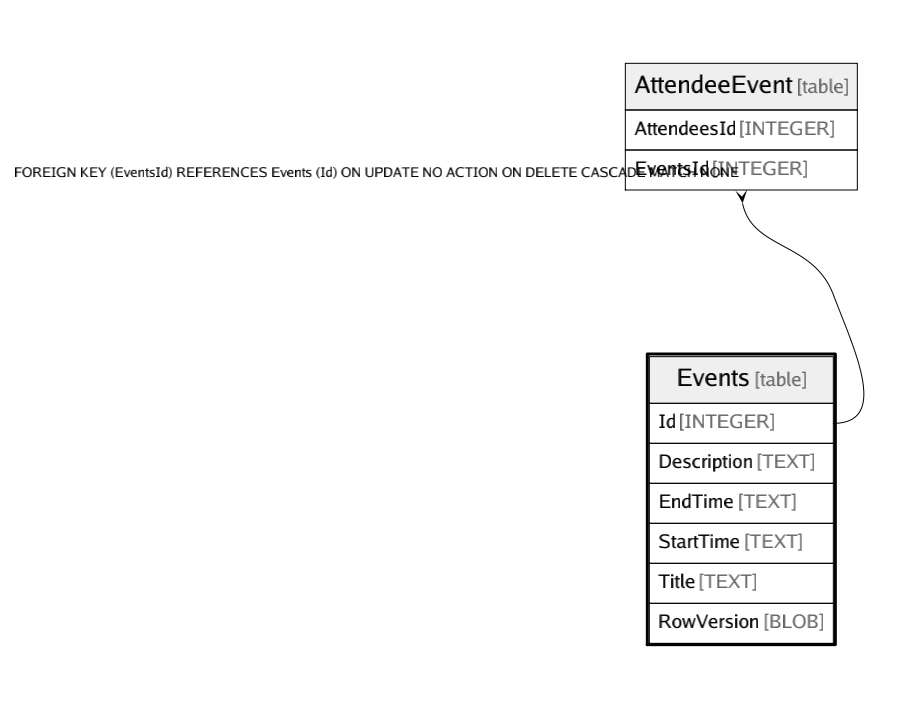

# Events

## Description

<details>
<summary><strong>Table Definition</strong></summary>

```sql
CREATE TABLE "Events" (
    "Id" INTEGER NOT NULL CONSTRAINT "PK_Events" PRIMARY KEY AUTOINCREMENT,
    "Description" TEXT NOT NULL,
    "EndTime" TEXT NOT NULL,
    "StartTime" TEXT NOT NULL,
    "Title" TEXT NOT NULL
, "RowVersion" BLOB NULL)
```

</details>

## Columns

| Name | Type | Default | Nullable | Children | Parents | Comment |
| ---- | ---- | ------- | -------- | -------- | ------- | ------- |
| Id | INTEGER |  | false | [AttendeeEvent](AttendeeEvent.md) |  |  |
| Description | TEXT |  | false |  |  |  |
| EndTime | TEXT |  | false |  |  |  |
| StartTime | TEXT |  | false |  |  |  |
| Title | TEXT |  | false |  |  |  |
| RowVersion | BLOB |  | true |  |  |  |

## Constraints

| Name | Type | Definition |
| ---- | ---- | ---------- |
| Id | PRIMARY KEY | PRIMARY KEY (Id) |

## Relations



---

> Generated by [tbls](https://github.com/k1LoW/tbls)
