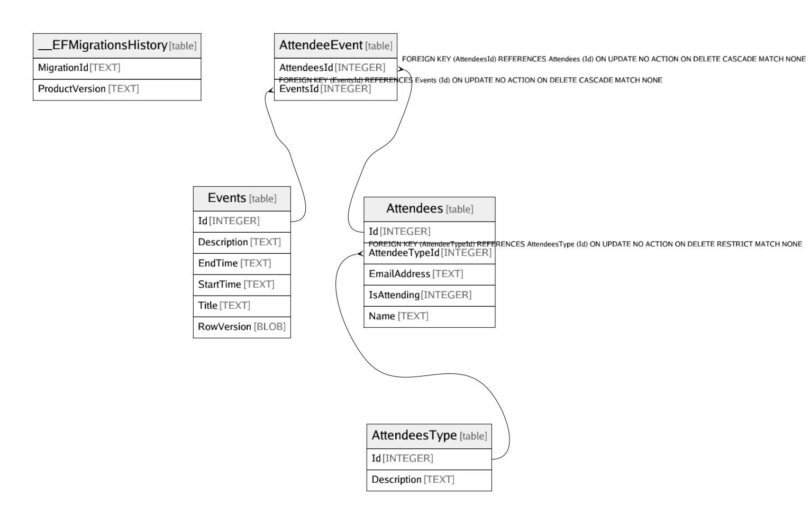

# events.db

## Tables

| Name | Columns | Comment | Type |
| ---- | ------- | ------- | ---- |
| [__EFMigrationsHistory](__EFMigrationsHistory.md) | 2 |  | table |
| [AttendeesType](AttendeesType.md) | 2 |  | table |
| [Events](Events.md) | 6 |  | table |
| [Attendees](Attendees.md) | 5 |  | table |
| [AttendeeEvent](AttendeeEvent.md) | 2 |  | table |

## Relations

---

> Generated by [tbls](https://github.com/k1LoW/tbls)
